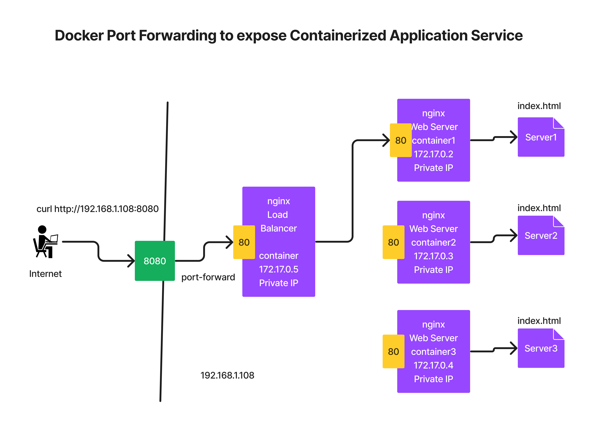

# Day 2

## What is Hypervisor?
- nothing but virtualization technology
- allows running multiple OS side by side on the same laptop/desktop/workstation/server
- there are 2 types
  1. Type1
     - used in Workstations/Servers
     - bare-metal Hypervisor
     - doesn't require Host OS, hence can be installed directly on a bare server with no OS
     - examples - VMWare vCenter/vSphere
  2. Type2
     - used in Laptops/Desktops/Workstations
     - this works on top of an existing OS (Host OS - Windows, Unix, Linux, Mac OS-X)
     - examples - VMWare Workstation, VMWare Fusion Oracle VirtualBox, Parallels, Microsoft Hyper-V, KVM
- within Virtual Machines you can install any OS ( Windows, Unix, Linux, Mac OS-X)
- each Virtual machine represents a fully functional Operating System
- each OS withint the virtual machines has its own dedicated OS Kernel
- Virtual Machines(VMs) are also as Guest OS
- each Virtual Machines get its own dedicated hardware resources
  - CPU Cores
  - RAM
  - Storage (HDD/SDD)
- hence this type of Virtualization is called as Heavy-weight Virtualization
- Processors (AMD or Intel)
  Intel Processor
  - virtualization feature is called VT-X
  AMD Processor
  - virtualization feature is called AMD-V
  
## What are Containers?
- light-weight virtualization
- containers are nothing but application process
- application virtualization technology
- is not an OS it is merely an application process
- for OS kernel related functionalities, containers depends on the Host OS Kernel
- technically containers runs on the Host OS kernel
- each containers runs in a separate namespace
- Linux Kernel
  1. Namespace - used to isolate one container from other container
  2. Control Groups (CGroups) - used to apply resource quota restrictions

## Containers vs Hypervisor
- each container represents one application while each VM represents one Operating system
- containers doesn't have OS Kernel but VMs have their own OS Kernel
- container doesn't get their own dedicated hardware but VMs get their own dedicated hardware resources
- both container and VMS have their own Network stack, IP address and File system

## What is a Container Engine?
- a high-level software that depends on Container runtimes to manage containers
- provides user-friendly commands to manage container images and containers
- these are the tools which are used by end-user like us
- examples
  - Docker
  - Podman

## What is a Container Runtime?
- is the utility that manages containers
  - creates a container
  - runs the containers
  - start/stop/restart a container
  - kill/delete container
- these are low-level tools which are normally used by Container Engines
- depends os kernel to create and manage containers
- these are not directly used by end-users
- examples
  - runC
  - LXC
  - containerd
  - CRI-O

## What are Container Orchestration Tools?
- it is a software that manage containers
- examples
  1. Docker SWARM
  2. Google Kubernetes
  3. RedHat OpenShift


# Docker commands

## Lab - Finding docker version
```
docker version
```

Expected output
<pre>
jegan@tektutor.org $ <b>docker --version</b>
Docker version 20.10.21, build 20.10.21-0ubuntu1~22.04.2
</pre>

## Lab - Print docker info
```
docker info
```

Expected output
<pre>
 jegan@tektutor.org  ~  docker info
Client:
 Context:    default
 Debug Mode: false

Server:
 Containers: 11
  Running: 0
  Paused: 0
  Stopped: 11
 Images: 27
 Server Version: 20.10.21
 Storage Driver: overlay2
  Backing Filesystem: extfs
  Supports d_type: true
  Native Overlay Diff: true
  userxattr: false
 Logging Driver: json-file
 Cgroup Driver: systemd
 Cgroup Version: 2
 Plugins:
  Volume: local
  Network: bridge host ipvlan macvlan null overlay
  Log: awslogs fluentd gcplogs gelf journald json-file local logentries splunk syslog
 Swarm: inactive
 Runtimes: io.containerd.runc.v2 io.containerd.runtime.v1.linux runc
 Default Runtime: runc
 Init Binary: docker-init
 containerd version: 
 runc version: 
 init version: 
 Security Options:
  apparmor
  seccomp
   Profile: default
  cgroupns
 Kernel Version: 5.19.0-35-generic
 Operating System: Ubuntu 22.04.2 LTS
 OSType: linux
 Architecture: x86_64
 CPUs: 48
 Total Memory: 125.5GiB
 Name: tektutor.org
 ID: 7TE4:VNOO:74TD:26WF:VH3Q:FQIN:LIM6:YVQV:RJ63:MY2C:A6ZL:VT33
 Docker Root Dir: /var/lib/docker
 Debug Mode: false
 Registry: https://index.docker.io/v1/
 Labels:
 Experimental: false
 Insecure Registries:
  127.0.0.0/8
 Live Restore Enabled: false
</pre>


## Lab - Listing the docker images in your local docker registry
```
docker images
```
Expected output
<pre>
 jegan@tektutor.org $ docker images
REPOSITORY                                TAG       IMAGE ID       CREATED         SIZE
docker.bintray.io/jfrog/artifactory-oss   latest    1b425cceed92   2 days ago      1.51GB
tektutor/centos-ansible-node              latest    c98813da9ef4   3 weeks ago     457MB
tektutor/ubuntu-ansible-node              latest    7169bf3260b9   3 weeks ago     228MB
gcr.io/k8s-minikube/kicbase               v0.0.37   01c0ce65fff7   2 months ago    1.15GB
centos                                    centos7   eeb6ee3f44bd   18 months ago   204MB
ubuntu                                    16.04     b6f507652425   19 months ago   135MB
</pre>

## Lab - Finding more details about a docker image
```
docker image inspect docker.bintray.io/jfrog/artifactory-oss
```

Expected output
<pre>
jegan@tektutor.org $ docker image inspect docker.bintray.io/jfrog/artifactory-oss
[
    {
        "Id": "sha256:1b425cceed925e92ecae539ffcab42e4821e709e15c45484178c6458c6f4a250",
        "RepoTags": [
            "docker.bintray.io/jfrog/artifactory-oss:latest"
        ],
        "RepoDigests": [
            "docker.bintray.io/jfrog/artifactory-oss@sha256:201428295c897d0f1eba95ecf714b4bc8e23146098fffbc2ffe6c467099fdfc6"
        ],
        "Parent": "",
        "Comment": "buildkit.dockerfile.v0",
        "Created": "2023-03-26T11:24:16.520015225Z",
        "Container": "",
        "ContainerConfig": {
            "Hostname": "",
            "Domainname": "",
            "User": "",
            "AttachStdin": false,
            "AttachStdout": false,
            "AttachStderr": false,
            "Tty": false,
            "OpenStdin": false,
            "StdinOnce": false,
            "Env": null,
            "Cmd": null,
            "Image": "",
            "Volumes": null,
            "WorkingDir": "",
            "Entrypoint": null,
            "OnBuild": null,
            "Labels": null
        },
        "DockerVersion": "",
        "Author": "",
        "Config": {
            "Hostname": "",
            "Domainname": "",
            "User": "artifactory",
            "AttachStdin": false,
            "AttachStdout": false,
            "AttachStderr": false,
            "ExposedPorts": {
                "8081/tcp": {}
            },
            "Tty": false,
            "OpenStdin": false,
            "StdinOnce": false,
            "Env": [
                "PATH=/usr/local/sbin:/usr/local/bin:/usr/sbin:/usr/bin:/sbin:/bin",
                "JF_ARTIFACTORY_USER=artifactory",
                "ARTIFACTORY_VERSION=7.55.9",
                "LIBAIO_VERSION=0.3.113-1",
                "ARTIFACTORY_BOOTSTRAP=/artifactory_bootstrap",
                "JF_PRODUCT_HOME=/opt/jfrog/artifactory",
                "JF_PRODUCT_DATA_INTERNAL=/var/opt/jfrog/artifactory",
                "RECOMMENDED_MAX_OPEN_FILES=32000",
                "MIN_MAX_OPEN_FILES=10000",
                "RECOMMENDED_MAX_OPEN_PROCESSES=1024",
                "TARGETARCH=amd64"
            ],
            "Cmd": null,
            "Image": "",
            "Volumes": {
                "/var/opt/jfrog/artifactory": {}
            },
            "WorkingDir": "/opt/jfrog/artifactory",
            "Entrypoint": [
                "/entrypoint-artifactory.sh"
            ],
            "OnBuild": null,
            "Labels": {
                "architecture": "x86_64",
                "build-date": "2023-01-17T14:19:54",
                "com.redhat.component": "ubi9-micro-container",
                "com.redhat.license_terms": "https://www.redhat.com/en/about/red-hat-end-user-license-agreements#UBI",
                "description": "Very small image which doesn't install the package manager.",
                "distribution-scope": "public",
                "io.buildah.version": "1.27.1",
                "io.k8s.description": "Very small image which doesn't install the package manager.",
                "io.k8s.display-name": "Ubi9-micro",
                "io.openshift.expose-services": "",
                "maintainer": "devops@jfrog.com",
                "name": "ubi9/ubi-micro",
                "release": "13",
                "summary": "ubi9 micro image",
                "url": "https://access.redhat.com/containers/#/registry.access.redhat.com/ubi9/ubi-micro/images/9.1.0-13",
                "vcs-ref": "c563e091e0c7bd5a69b2a46990dda4f59595aa37",
                "vcs-type": "git",
                "vendor": "Red Hat, Inc.",
                "version": "9.1.0"
            }
        },
        "Architecture": "amd64",
        "Os": "linux",
        "Size": 1507787129,
        "VirtualSize": 1507787129,
        "GraphDriver": {
            "Data": {
                "LowerDir": "/var/lib/docker/overlay2/9dfd0a0b28ffd778630bd911d043035aa4f302b757c9648058dc7482c872e787/diff:/var/lib/docker/overlay2/1f2153fdec8eb662c3aee56c90d2cefeeaa95f9039dfba8a7399fb125a6f7dd7/diff:/var/lib/docker/overlay2/a081c2e7d184549b6240adc748c5c99050c488877b7128a4ca1e042f372d031d/diff:/var/lib/docker/overlay2/229de58cb3ea810a32fd568ccf42e6df49886d809000d8144dbd9fe21e56ccb6/diff:/var/lib/docker/overlay2/4a36ae2cd119a780600866d3fc231b591800b650fc6f0067112a477a51a5c248/diff:/var/lib/docker/overlay2/50e2f707e8a2f12c6d6ebb533df1e32db2d66d4a6c54108a0976e6874a4649ac/diff:/var/lib/docker/overlay2/99e1a55511e88f8a1c824285d2168ab1f6dc23ff9b8cd43667c4bb04f07de12c/diff:/var/lib/docker/overlay2/71e6578db6cf21268a72abb4ea22d4cfd11c41ce59e9a49e496e0f326e527802/diff:/var/lib/docker/overlay2/2293dbf1ce30d83f7daac478b13f05834ba243f5caaadde127dc033c9897ae7c/diff:/var/lib/docker/overlay2/a6729d187d8974709a29996357c9ab3a57a5188d1f507adf615fe39f93fbb38e/diff",
                "MergedDir": "/var/lib/docker/overlay2/1c52790fbe5d97edb3fb7ea6d2c3b89f134adb30c5d3e560d9b7d875adf030bb/merged",
                "UpperDir": "/var/lib/docker/overlay2/1c52790fbe5d97edb3fb7ea6d2c3b89f134adb30c5d3e560d9b7d875adf030bb/diff",
                "WorkDir": "/var/lib/docker/overlay2/1c52790fbe5d97edb3fb7ea6d2c3b89f134adb30c5d3e560d9b7d875adf030bb/work"
            },
            "Name": "overlay2"
        },
        "RootFS": {
            "Type": "layers",
            "Layers": [
                "sha256:a4c04ef9f22efacfeef90de7240e03c302e7a18b0ed902f8a3e845ff96147e51",
                "sha256:2c9fd352aa6c1336912749e6b613a321492a94b8ff66a80cae0990ee5d509ac2",
                "sha256:9c228b073eb781d01e452055d825ee2f72228d8a9f4bcbcdcd85c2a019acad1b",
                "sha256:efc217f7a7c85944d6b34ef9204925bab9ef355a185022be5010fa06058eb38b",
                "sha256:5073167ff8bf1bb156813f78adbfae78d848ef7147b85f5d80faa65a94b4e7d6",
                "sha256:5f70bf18a086007016e948b04aed3b82103a36bea41755b6cddfaf10ace3c6ef",
                "sha256:8851ad098a1e5b50c3c438918aaf2b3bd05f6873b14eeb5ebd9e1281e82711d8",
                "sha256:b46b989987f871171b659a6612e9e3d9dc62ec326c37dca1229042b93e528bbe",
                "sha256:257512b6e6b96e24062b024ded82588159813d52cfee8598cf671fe496b58f94",
                "sha256:a4b86dc21d4076600961c33566fdbe4f0f7402f8ad40fc048707ba836a7d6c15",
                "sha256:5f70bf18a086007016e948b04aed3b82103a36bea41755b6cddfaf10ace3c6ef"
            ]
        },
        "Metadata": {
            "LastTagTime": "0001-01-01T00:00:00Z"
        }
    }
]
</pre>

## Lab - Download Docker Image from Docker Hub(Remote Registry) to Local Docker Registry
```
docker pull busybox:latest
```

Expected output
<pre>
jegan@tektutor.org $ docker pull busybox:latest
latest: Pulling from library/busybox
4b35f584bb4f: Pull complete 
Digest: sha256:b5d6fe0712636ceb7430189de28819e195e8966372edfc2d9409d79402a0dc16
Status: Downloaded newer image for busybox:latest
docker.io/library/busybox:latest

jegan@tektutor.org $ docker images
REPOSITORY                                TAG       IMAGE ID       CREATED         SIZE
docker.bintray.io/jfrog/artifactory-oss   latest    1b425cceed92   2 days ago      1.51GB
busybox                                   latest    7cfbbec8963d   11 days ago     4.86MB
tektutor/centos-ansible-node              latest    c98813da9ef4   3 weeks ago     457MB
tektutor/ubuntu-ansible-node              latest    7169bf3260b9   3 weeks ago     228MB
gcr.io/k8s-minikube/kicbase               v0.0.37   01c0ce65fff7   2 months ago    1.15GB
centos                                    centos7   eeb6ee3f44bd   18 months ago   204MB
ubuntu                                    16.04     b6f507652425   19 months ago   135MB
</pre>

## Lab - Removing an image from local registry
```
docker rmi busybox:latest
```

## Lab - Creating your first docker container
```
docker run -dit --name ubuntu1 --hostname ubuntu1 ubuntu:22.04 /bin/bash
```

Expected output
<pre>
jegan@tektutor.org $ docker run -dit --name ubuntu1 --hostname ubuntu1 ubuntu:22.04 /bin/bash
Unable to find image 'ubuntu:22.04' locally
22.04: Pulling from library/ubuntu
2ab09b027e7f: Pull complete 
Digest: sha256:67211c14fa74f070d27cc59d69a7fa9aeff8e28ea118ef3babc295a0428a6d21
Status: Downloaded newer image for ubuntu:22.04
5d9611eb44157f3ef85f10545b0528a0ee4a695ea428dd347b03e9f86d467bf4

jegan@tektutor.org $ docker ps
CONTAINER ID   IMAGE          COMMAND       CREATED         STATUS         PORTS     NAMES
5d9611eb4415   ubuntu:22.04   "/bin/bash"   4 seconds ago   Up 4 seconds             ubuntu1

jegan@tektutor.org $ docker exec -it ubuntu1 bash
root@ubuntu1:/# ifconfig
bash: ifconfig: command not found
root@ubuntu1:/# exit         
exit
</pre>

## Lab - Create bunch of containers in background
```
docker run -dit --name ubuntu2 --hostname ubuntu2 ubuntu:22.04 /bin/bash
docker run -dit --name ubuntu3 --hostname ubuntu3 ubuntu:22.04 /bin/bash
```

## Lab - Deleting a running container forcibly
```
docker rm -f ubuntu1
docker rm -f ubuntu2 ubuntu3
```

## Lab - Deleting a running container gracefully
```
docker stop ubuntu1
docker stop ubuntu2 ubuntu3
docker rm ubuntu1 
docker rm ubuntu2 ubuntu3
```

## Lab - Deploy wordpress and mysql database ( multi-container application )

#### Install docker compose
```
mkdir -p ~/.docker/cli-plugins/
curl -SL https://github.com/docker/compose/releases/download/v2.3.3/docker-compose-linux-x86_64 -o ~/.docker/cli-plugins/docker-compose
chmod +x ~/.docker/cli-plugins/docker-compose
docker compose version
```

#### Deploy wordpress with mysql db
```
cd ~/devops-march-2023
git pull

cd Day2
docker compose up
```

Expected output
<pre>
Attaching to day2-db-1, day2-wordpress-1
day2-db-1         | 2023-03-29 05:43:23+00:00 [Note] [Entrypoint]: Entrypoint script for MySQL Server 5.7.41-1.el7 started.
day2-wordpress-1  | WordPress not found in /var/www/html - copying now...
day2-wordpress-1  | Complete! WordPress has been successfully copied to /var/www/html
day2-wordpress-1  | No 'wp-config.php' found in /var/www/html, but 'WORDPRESS_...' variables supplied; copying 'wp-config-docker.php' (WORDPRESS_DB_HOST WORDPRESS_DB_NAME WORDPRESS_DB_PASSWORD WORDPRESS_DB_USER)
day2-db-1         | 2023-03-29 05:43:23+00:00 [Note] [Entrypoint]: Switching to dedicated user 'mysql'
day2-db-1         | 2023-03-29 05:43:23+00:00 [Note] [Entrypoint]: Entrypoint script for MySQL Server 5.7.41-1.el7 started.
day2-wordpress-1  | AH00558: apache2: Could not reliably determine the server's fully qualified domain name, using 172.18.0.3. Set the 'ServerName' directive globally to suppress this message
day2-wordpress-1  | AH00558: apache2: Could not reliably determine the server's fully qualified domain name, using 172.18.0.3. Set the 'ServerName' directive globally to suppress this message
day2-wordpress-1  | [Wed Mar 29 05:43:23.930181 2023] [mpm_prefork:notice] [pid 1] AH00163: Apache/2.4.56 (Debian) PHP/8.0.28 configured -- resuming normal operations
day2-wordpress-1  | [Wed Mar 29 05:43:23.930214 2023] [core:notice] [pid 1] AH00094: Command line: 'apache2 -D FOREGROUND'
day2-db-1         | 2023-03-29 05:43:24+00:00 [Note] [Entrypoint]: Initializing database files
day2-db-1         | 2023-03-29T05:43:24.159310Z 0 [Warning] TIMESTAMP with implicit DEFAULT value is deprecated. Please use --explicit_defaults_for_timestamp server option (see documentation for more details).
day2-db-1         | 2023-03-29T05:43:24.312627Z 0 [Warning] InnoDB: New log files created, LSN=45790
day2-db-1         | 2023-03-29T05:43:24.345898Z 0 [Warning] InnoDB: Creating foreign key constraint system tables.
day2-db-1         | 2023-03-29T05:43:24.402136Z 0 [Warning] No existing UUID has been found, so we assume that this is the first time that this server has been started. Generating a new UUID: 9f244193-cdf4-11ed-a7bc-0242ac120002.
day2-db-1         | 2023-03-29T05:43:24.403778Z 0 [Warning] Gtid table is not ready to be used. Table 'mysql.gtid_executed' cannot be opened.
day2-db-1         | 2023-03-29T05:43:24.524826Z 0 [Warning] A deprecated TLS version TLSv1 is enabled. Please use TLSv1.2 or higher.
day2-db-1         | 2023-03-29T05:43:24.524837Z 0 [Warning] A deprecated TLS version TLSv1.1 is enabled. Please use TLSv1.2 or higher.
day2-db-1         | 2023-03-29T05:43:24.525264Z 0 [Warning] CA certificate ca.pem is self signed.
day2-db-1         | 2023-03-29T05:43:24.803689Z 1 [Warning] root@localhost is created with an empty password ! Please consider switching off the --initialize-insecure option.
day2-db-1         | 2023-03-29 05:43:27+00:00 [Note] [Entrypoint]: Database files initialized
day2-db-1         | 2023-03-29 05:43:27+00:00 [Note] [Entrypoint]: Starting temporary server
day2-db-1         | 2023-03-29 05:43:27+00:00 [Note] [Entrypoint]: Waiting for server startup
day2-db-1         | 2023-03-29T05:43:27.498845Z 0 [Warning] TIMESTAMP with implicit DEFAULT value is deprecated. Please use --explicit_defaults_for_timestamp server option (see documentation for more details).
day2-db-1         | 2023-03-29T05:43:27.500237Z 0 [Note] mysqld (mysqld 5.7.41) starting as process 125 ...
day2-db-1         | 2023-03-29T05:43:27.503002Z 0 [Note] InnoDB: PUNCH HOLE support available
day2-db-1         | 2023-03-29T05:43:27.503019Z 0 [Note] InnoDB: Mutexes and rw_locks use GCC atomic builtins
day2-db-1         | 2023-03-29T05:43:27.503021Z 0 [Note] InnoDB: Uses event mutexes
day2-db-1         | 2023-03-29T05:43:27.503025Z 0 [Note] InnoDB: GCC builtin __atomic_thread_fence() is used for memory barrier
day2-db-1         | 2023-03-29T05:43:27.503027Z 0 [Note] InnoDB: Compressed tables use zlib 1.2.12
day2-db-1         | 2023-03-29T05:43:27.503029Z 0 [Note] InnoDB: Using Linux native AIO
day2-db-1         | 2023-03-29T05:43:27.503243Z 0 [Note] InnoDB: Number of pools: 1
day2-db-1         | 2023-03-29T05:43:27.503330Z 0 [Note] InnoDB: Using CPU crc32 instructions
day2-db-1         | 2023-03-29T05:43:27.505181Z 0 [Note] InnoDB: Initializing buffer pool, total size = 128M, instances = 1, chunk size = 128M
day2-db-1         | 2023-03-29T05:43:27.511762Z 0 [Note] InnoDB: Completed initialization of buffer pool
day2-db-1         | 2023-03-29T05:43:27.513764Z 0 [Note] InnoDB: If the mysqld execution user is authorized, page cleaner thread priority can be changed. See the man page of setpriority().
day2-db-1         | 2023-03-29T05:43:27.527081Z 0 [Note] InnoDB: Highest supported file format is Barracuda.
day2-db-1         | 2023-03-29T05:43:27.544638Z 0 [Note] InnoDB: Creating shared tablespace for temporary tables
day2-db-1         | 2023-03-29T05:43:27.544709Z 0 [Note] InnoDB: Setting file './ibtmp1' size to 12 MB. Physically writing the file full; Please wait ...
day2-db-1         | 2023-03-29T05:43:27.565035Z 0 [Note] InnoDB: File './ibtmp1' size is now 12 MB.
day2-db-1         | 2023-03-29T05:43:27.565776Z 0 [Note] InnoDB: 96 redo rollback segment(s) found. 96 redo rollback segment(s) are active.
day2-db-1         | 2023-03-29T05:43:27.565783Z 0 [Note] InnoDB: 32 non-redo rollback segment(s) are active.
day2-db-1         | 2023-03-29T05:43:27.566148Z 0 [Note] InnoDB: Waiting for purge to start
day2-db-1         | 2023-03-29T05:43:27.616378Z 0 [Note] InnoDB: 5.7.41 started; log sequence number 2762314
day2-db-1         | 2023-03-29T05:43:27.616762Z 0 [Note] InnoDB: Loading buffer pool(s) from /var/lib/mysql/ib_buffer_pool
day2-db-1         | 2023-03-29T05:43:27.617062Z 0 [Note] Plugin 'FEDERATED' is disabled.
day2-db-1         | 2023-03-29T05:43:27.619979Z 0 [Note] InnoDB: Buffer pool(s) load completed at 230329  5:43:27
day2-db-1         | 2023-03-29T05:43:27.629224Z 0 [Note] Found ca.pem, server-cert.pem and server-key.pem in data directory. Trying to enable SSL support using them.
day2-db-1         | 2023-03-29T05:43:27.629240Z 0 [Note] Skipping generation of SSL certificates as certificate files are present in data directory.
day2-db-1         | 2023-03-29T05:43:27.629247Z 0 [Warning] A deprecated TLS version TLSv1 is enabled. Please use TLSv1.2 or higher.
day2-db-1         | 2023-03-29T05:43:27.629251Z 0 [Warning] A deprecated TLS version TLSv1.1 is enabled. Please use TLSv1.2 or higher.
day2-db-1         | 2023-03-29T05:43:27.630389Z 0 [Warning] CA certificate ca.pem is self signed.
day2-db-1         | 2023-03-29T05:43:27.630446Z 0 [Note] Skipping generation of RSA key pair as key files are present in data directory.
day2-db-1         | 2023-03-29T05:43:27.633448Z 0 [Warning] Insecure configuration for --pid-file: Location '/var/run/mysqld' in the path is accessible to all OS users. Consider choosing a different directory.
day2-db-1         | 2023-03-29T05:43:27.644122Z 0 [Note] Event Scheduler: Loaded 0 events
day2-db-1         | 2023-03-29T05:43:27.644420Z 0 [Note] mysqld: ready for connections.
day2-db-1         | Version: '5.7.41'  socket: '/var/run/mysqld/mysqld.sock'  port: 0  MySQL Community Server (GPL)
day2-db-1         | 2023-03-29 05:43:28+00:00 [Note] [Entrypoint]: Temporary server started.
day2-db-1         | '/var/lib/mysql/mysql.sock' -> '/var/run/mysqld/mysqld.sock'
day2-db-1         | 2023-03-29T05:43:28.386859Z 3 [Note] InnoDB: Stopping purge
day2-db-1         | 2023-03-29T05:43:28.390362Z 3 [Note] InnoDB: Resuming purge
day2-db-1         | 2023-03-29T05:43:28.391915Z 3 [Note] InnoDB: Stopping purge
day2-db-1         | 2023-03-29T05:43:28.394988Z 3 [Note] InnoDB: Resuming purge
day2-db-1         | 2023-03-29T05:43:28.396624Z 3 [Note] InnoDB: Stopping purge
day2-db-1         | 2023-03-29T05:43:28.399721Z 3 [Note] InnoDB: Resuming purge
day2-db-1         | 2023-03-29T05:43:28.401925Z 3 [Note] InnoDB: Stopping purge
day2-db-1         | 2023-03-29T05:43:28.406064Z 3 [Note] InnoDB: Resuming purge
day2-db-1         | Warning: Unable to load '/usr/share/zoneinfo/iso3166.tab' as time zone. Skipping it.
day2-db-1         | Warning: Unable to load '/usr/share/zoneinfo/leapseconds' as time zone. Skipping it.
day2-db-1         | Warning: Unable to load '/usr/share/zoneinfo/tzdata.zi' as time zone. Skipping it.
day2-db-1         | Warning: Unable to load '/usr/share/zoneinfo/zone.tab' as time zone. Skipping it.
day2-db-1         | Warning: Unable to load '/usr/share/zoneinfo/zone1970.tab' as time zone. Skipping it.
day2-db-1         | 2023-03-29 05:43:29+00:00 [Note] [Entrypoint]: GENERATED ROOT PASSWORD: 5YP/PuH4beIYLTakZp1WjCOohoeIQrOE
day2-db-1         | 2023-03-29 05:43:29+00:00 [Note] [Entrypoint]: Creating database exampledb
day2-db-1         | 2023-03-29 05:43:29+00:00 [Note] [Entrypoint]: Creating user exampleuser
day2-db-1         | 2023-03-29 05:43:29+00:00 [Note] [Entrypoint]: Giving user exampleuser access to schema exampledb
day2-db-1         | 
day2-db-1         | 2023-03-29 05:43:29+00:00 [Note] [Entrypoint]: Stopping temporary server
day2-db-1         | 2023-03-29T05:43:29.653160Z 0 [Note] Giving 0 client threads a chance to die gracefully
day2-db-1         | 2023-03-29T05:43:29.653198Z 0 [Note] Shutting down slave threads
day2-db-1         | 2023-03-29T05:43:29.653205Z 0 [Note] Forcefully disconnecting 0 remaining clients
day2-db-1         | 2023-03-29T05:43:29.653214Z 0 [Note] Event Scheduler: Purging the queue. 0 events
day2-db-1         | 2023-03-29T05:43:29.653276Z 0 [Note] Binlog end
day2-db-1         | 2023-03-29T05:43:29.654187Z 0 [Note] Shutting down plugin 'ngram'
day2-db-1         | 2023-03-29T05:43:29.654203Z 0 [Note] Shutting down plugin 'partition'
day2-db-1         | 2023-03-29T05:43:29.654209Z 0 [Note] Shutting down plugin 'BLACKHOLE'
day2-db-1         | 2023-03-29T05:43:29.654215Z 0 [Note] Shutting down plugin 'ARCHIVE'
day2-db-1         | 2023-03-29T05:43:29.654219Z 0 [Note] Shutting down plugin 'PERFORMANCE_SCHEMA'
day2-db-1         | 2023-03-29T05:43:29.654273Z 0 [Note] Shutting down plugin 'MRG_MYISAM'
day2-db-1         | 2023-03-29T05:43:29.654280Z 0 [Note] Shutting down plugin 'MyISAM'
day2-db-1         | 2023-03-29T05:43:29.654291Z 0 [Note] Shutting down plugin 'INNODB_SYS_VIRTUAL'
day2-db-1         | 2023-03-29T05:43:29.654297Z 0 [Note] Shutting down plugin 'INNODB_SYS_DATAFILES'
day2-db-1         | 2023-03-29T05:43:29.654302Z 0 [Note] Shutting down plugin 'INNODB_SYS_TABLESPACES'
day2-db-1         | 2023-03-29T05:43:29.654306Z 0 [Note] Shutting down plugin 'INNODB_SYS_FOREIGN_COLS'
day2-db-1         | 2023-03-29T05:43:29.654311Z 0 [Note] Shutting down plugin 'INNODB_SYS_FOREIGN'
day2-db-1         | 2023-03-29T05:43:29.654315Z 0 [Note] Shutting down plugin 'INNODB_SYS_FIELDS'
day2-db-1         | 2023-03-29T05:43:29.654319Z 0 [Note] Shutting down plugin 'INNODB_SYS_COLUMNS'
day2-db-1         | 2023-03-29T05:43:29.654323Z 0 [Note] Shutting down plugin 'INNODB_SYS_INDEXES'
day2-db-1         | 2023-03-29T05:43:29.654329Z 0 [Note] Shutting down plugin 'INNODB_SYS_TABLESTATS'
day2-db-1         | 2023-03-29T05:43:29.654333Z 0 [Note] Shutting down plugin 'INNODB_SYS_TABLES'
day2-db-1         | 2023-03-29T05:43:29.654337Z 0 [Note] Shutting down plugin 'INNODB_FT_INDEX_TABLE'
day2-db-1         | 2023-03-29T05:43:29.654341Z 0 [Note] Shutting down plugin 'INNODB_FT_INDEX_CACHE'
day2-db-1         | 2023-03-29T05:43:29.654345Z 0 [Note] Shutting down plugin 'INNODB_FT_CONFIG'
day2-db-1         | 2023-03-29T05:43:29.654349Z 0 [Note] Shutting down plugin 'INNODB_FT_BEING_DELETED'
day2-db-1         | 2023-03-29T05:43:29.654354Z 0 [Note] Shutting down plugin 'INNODB_FT_DELETED'
day2-db-1         | 2023-03-29T05:43:29.654358Z 0 [Note] Shutting down plugin 'INNODB_FT_DEFAULT_STOPWORD'
day2-db-1         | 2023-03-29T05:43:29.654362Z 0 [Note] Shutting down plugin 'INNODB_METRICS'
day2-db-1         | 2023-03-29T05:43:29.654367Z 0 [Note] Shutting down plugin 'INNODB_TEMP_TABLE_INFO'
day2-db-1         | 2023-03-29T05:43:29.654371Z 0 [Note] Shutting down plugin 'INNODB_BUFFER_POOL_STATS'
day2-db-1         | 2023-03-29T05:43:29.654375Z 0 [Note] Shutting down plugin 'INNODB_BUFFER_PAGE_LRU'
day2-db-1         | 2023-03-29T05:43:29.654379Z 0 [Note] Shutting down plugin 'INNODB_BUFFER_PAGE'
day2-db-1         | 2023-03-29T05:43:29.654383Z 0 [Note] Shutting down plugin 'INNODB_CMP_PER_INDEX_RESET'
day2-db-1         | 2023-03-29T05:43:29.654388Z 0 [Note] Shutting down plugin 'INNODB_CMP_PER_INDEX'
day2-db-1         | 2023-03-29T05:43:29.654393Z 0 [Note] Shutting down plugin 'INNODB_CMPMEM_RESET'
day2-db-1         | 2023-03-29T05:43:29.654397Z 0 [Note] Shutting down plugin 'INNODB_CMPMEM'
day2-db-1         | 2023-03-29T05:43:29.654401Z 0 [Note] Shutting down plugin 'INNODB_CMP_RESET'
day2-db-1         | 2023-03-29T05:43:29.654406Z 0 [Note] Shutting down plugin 'INNODB_CMP'
day2-db-1         | 2023-03-29T05:43:29.654410Z 0 [Note] Shutting down plugin 'INNODB_LOCK_WAITS'
day2-db-1         | 2023-03-29T05:43:29.654415Z 0 [Note] Shutting down plugin 'INNODB_LOCKS'
day2-db-1         | 2023-03-29T05:43:29.654420Z 0 [Note] Shutting down plugin 'INNODB_TRX'
day2-db-1         | 2023-03-29T05:43:29.654424Z 0 [Note] Shutting down plugin 'InnoDB'
day2-db-1         | 2023-03-29T05:43:29.654547Z 0 [Note] InnoDB: FTS optimize thread exiting.
day2-db-1         | 2023-03-29T05:43:29.654656Z 0 [Note] InnoDB: Starting shutdown...
day2-db-1         | 2023-03-29T05:43:29.754951Z 0 [Note] InnoDB: Dumping buffer pool(s) to /var/lib/mysql/ib_buffer_pool
day2-db-1         | 2023-03-29T05:43:29.756036Z 0 [Note] InnoDB: Buffer pool(s) dump completed at 230329  5:43:29
day2-db-1         | 2023-03-29T05:43:31.470377Z 0 [Note] InnoDB: Shutdown completed; log sequence number 12213276
day2-db-1         | 2023-03-29T05:43:31.474447Z 0 [Note] InnoDB: Removed temporary tablespace data file: "ibtmp1"
day2-db-1         | 2023-03-29T05:43:31.474473Z 0 [Note] Shutting down plugin 'MEMORY'
day2-db-1         | 2023-03-29T05:43:31.474480Z 0 [Note] Shutting down plugin 'CSV'
day2-db-1         | 2023-03-29T05:43:31.474486Z 0 [Note] Shutting down plugin 'sha256_password'
day2-db-1         | 2023-03-29T05:43:31.474490Z 0 [Note] Shutting down plugin 'mysql_native_password'
day2-db-1         | 2023-03-29T05:43:31.474750Z 0 [Note] Shutting down plugin 'binlog'
day2-db-1         | 2023-03-29T05:43:31.477979Z 0 [Note] mysqld: Shutdown complete
day2-db-1         | 
day2-db-1         | 2023-03-29 05:43:31+00:00 [Note] [Entrypoint]: Temporary server stopped
day2-db-1         | 
day2-db-1         | 2023-03-29 05:43:31+00:00 [Note] [Entrypoint]: MySQL init process done. Ready for start up.
day2-db-1         | 
day2-db-1         | 2023-03-29T05:43:31.859425Z 0 [Warning] TIMESTAMP with implicit DEFAULT value is deprecated. Please use --explicit_defaults_for_timestamp server option (see documentation for more details).
day2-db-1         | 2023-03-29T05:43:31.860864Z 0 [Note] mysqld (mysqld 5.7.41) starting as process 1 ...
day2-db-1         | 2023-03-29T05:43:31.863602Z 0 [Note] InnoDB: PUNCH HOLE support available
day2-db-1         | 2023-03-29T05:43:31.863620Z 0 [Note] InnoDB: Mutexes and rw_locks use GCC atomic builtins
day2-db-1         | 2023-03-29T05:43:31.863622Z 0 [Note] InnoDB: Uses event mutexes
day2-db-1         | 2023-03-29T05:43:31.863625Z 0 [Note] InnoDB: GCC builtin __atomic_thread_fence() is used for memory barrier
day2-db-1         | 2023-03-29T05:43:31.863627Z 0 [Note] InnoDB: Compressed tables use zlib 1.2.12
day2-db-1         | 2023-03-29T05:43:31.863630Z 0 [Note] InnoDB: Using Linux native AIO
day2-db-1         | 2023-03-29T05:43:31.863842Z 0 [Note] InnoDB: Number of pools: 1
day2-db-1         | 2023-03-29T05:43:31.863928Z 0 [Note] InnoDB: Using CPU crc32 instructions
day2-db-1         | 2023-03-29T05:43:31.865366Z 0 [Note] InnoDB: Initializing buffer pool, total size = 128M, instances = 1, chunk size = 128M
day2-db-1         | 2023-03-29T05:43:31.872358Z 0 [Note] InnoDB: Completed initialization of buffer pool
day2-db-1         | 2023-03-29T05:43:31.874328Z 0 [Note] InnoDB: If the mysqld execution user is authorized, page cleaner thread priority can be changed. See the man page of setpriority().
day2-db-1         | 2023-03-29T05:43:31.886715Z 0 [Note] InnoDB: Highest supported file format is Barracuda.
day2-db-1         | 2023-03-29T05:43:31.898871Z 0 [Note] InnoDB: Creating shared tablespace for temporary tables
day2-db-1         | 2023-03-29T05:43:31.898941Z 0 [Note] InnoDB: Setting file './ibtmp1' size to 12 MB. Physically writing the file full; Please wait ...
day2-db-1         | 2023-03-29T05:43:31.918113Z 0 [Note] InnoDB: File './ibtmp1' size is now 12 MB.
day2-db-1         | 2023-03-29T05:43:31.918870Z 0 [Note] InnoDB: 96 redo rollback segment(s) found. 96 redo rollback segment(s) are active.
day2-db-1         | 2023-03-29T05:43:31.918877Z 0 [Note] InnoDB: 32 non-redo rollback segment(s) are active.
day2-db-1         | 2023-03-29T05:43:31.919215Z 0 [Note] InnoDB: Waiting for purge to start
day2-db-1         | 2023-03-29T05:43:31.969436Z 0 [Note] InnoDB: 5.7.41 started; log sequence number 12213276
day2-db-1         | 2023-03-29T05:43:31.969846Z 0 [Note] InnoDB: Loading buffer pool(s) from /var/lib/mysql/ib_buffer_pool
day2-db-1         | 2023-03-29T05:43:31.970143Z 0 [Note] Plugin 'FEDERATED' is disabled.
day2-db-1         | 2023-03-29T05:43:31.976665Z 0 [Note] InnoDB: Buffer pool(s) load completed at 230329  5:43:31
day2-db-1         | 2023-03-29T05:43:31.983065Z 0 [Note] Found ca.pem, server-cert.pem and server-key.pem in data directory. Trying to enable SSL support using them.
day2-db-1         | 2023-03-29T05:43:31.983078Z 0 [Note] Skipping generation of SSL certificates as certificate files are present in data directory.
day2-db-1         | 2023-03-29T05:43:31.983083Z 0 [Warning] A deprecated TLS version TLSv1 is enabled. Please use TLSv1.2 or higher.
day2-db-1         | 2023-03-29T05:43:31.983086Z 0 [Warning] A deprecated TLS version TLSv1.1 is enabled. Please use TLSv1.2 or higher.
day2-db-1         | 2023-03-29T05:43:31.984057Z 0 [Warning] CA certificate ca.pem is self signed.
day2-db-1         | 2023-03-29T05:43:31.984104Z 0 [Note] Skipping generation of RSA key pair as key files are present in data directory.
day2-db-1         | 2023-03-29T05:43:31.984481Z 0 [Note] Server hostname (bind-address): '*'; port: 3306
day2-db-1         | 2023-03-29T05:43:31.984532Z 0 [Note] IPv6 is available.
day2-db-1         | 2023-03-29T05:43:31.984548Z 0 [Note]   - '::' resolves to '::';
day2-db-1         | 2023-03-29T05:43:31.984568Z 0 [Note] Server socket created on IP: '::'.
day2-db-1         | 2023-03-29T05:43:31.986371Z 0 [Warning] Insecure configuration for --pid-file: Location '/var/run/mysqld' in the path is accessible to all OS users. Consider choosing a different directory.
day2-db-1         | 2023-03-29T05:43:31.996022Z 0 [Note] Event Scheduler: Loaded 0 events
day2-db-1         | 2023-03-29T05:43:31.996225Z 0 [Note] mysqld: ready for connections.
day2-db-1         | Version: '5.7.41'  socket: '/var/run/mysqld/mysqld.sock'  port: 3306  MySQL Community Server (GPL)
</pre>


#### Accessing wordpress dashboard on RPS Centos web browser
```
http://localhost:8080
```

## Lab - Setting up a Load Balancer using nginx



#### Let us create 3 web server containers
```
docker run -d --name web1 --hostname web1 nginx:latest
docker run -d --name web2 --hostname web2 nginx:latest
docker run -d --name web3 --hostname web3 nginx:latest
```

Find the IP address of the web1, web2 and web3 containers
```
docker inspect -f {{.NetworkSettings.IPAddress}} web1
docker inspect -f {{.NetworkSettings.IPAddress}} web2
docker inspect web3 | grep IPA
```

Let's us list and see if they running
```
docker ps
```

### Let us create the Load Balancer container with port-forward to expose the container service to outside world
```
docker run -d --name lb --hostname lb -p 8090:80 nginx:latest
```

See if the lb container is running
```
docker ps
```

Copy the lb configuration into the lb container
```
cd ~/devops-march-2023
git pull

cd Day2
docker cp nginx.conf lb:/etc/nginx/nginx.conf
```

We need to restart the lb container to apply the lb config changes
```
docker restart lb
```

See if the lb container runs after config changes
```
docker ps
```

Let's customize the index.html web page in every web server
```
echo "Server 1" > index.html
docker cp index.html web1:/usr/share/nginx/html/index.html

echo "Server 2" > index.html
docker cp index.html web2:/usr/share/nginx/html/index.html

echo "Server 3" > index.html
docker cp index.html web3:/usr/share/nginx/html/index.html
```

Testing the round-robin lb configuration from your rps centos web browser
```
http://localhost:8090
```

## Lab - Volume Mounting ( Externally storing db data )
```
mkdir -p /tmp/mysql

docker run -d --name mysql --hostname mysql -v /tmp/mysql:/var/lib/mysql -e MYSQL_ROOT_PASSWORD=admin@123 mysql:latest
```

List and see if the mysql container is running
```
docker ps
```

Get inside the container shell
```
docker exec -it mysql sh
mysql -u root
```
When it prompts for password, type 'admin@123' without quotes.

Now let's create a Database
```
CREATE DATABASE tektutor;
USE tektutor;
CREATE TABLE Training ( id INT NOT NULL, name VARCHAR(50), duration VARCHAR(50), PRIMARY KEY(id) );
INSERT INTO Training VALUES ( 1, "DevOps", "5 Days" );
SELECT * FROM Training;
exit
exit
```

Now let's delete the mysql container
```
docker rm -f mysql
```

Now create a new container
```
docker run -d --name mysql --hostname mysql -v /tmp/mysql:/var/lib/mysql -e MYSQL_ROOT_PASSWORD=admin@123 mysql:latest

docker exec -it mysql sh

mysql -u root -p
```
When it prompts for password, type 'admin@123' without quotes.

Let' see if the database that we created in the previous mysql container is still intact
```
SHOW DATABASES;
USE tektutor;
SHOW TABLES;
SELECT * FROM Training;
exit
exit
```


