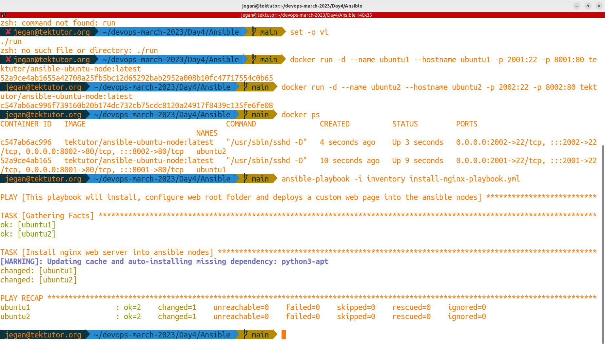
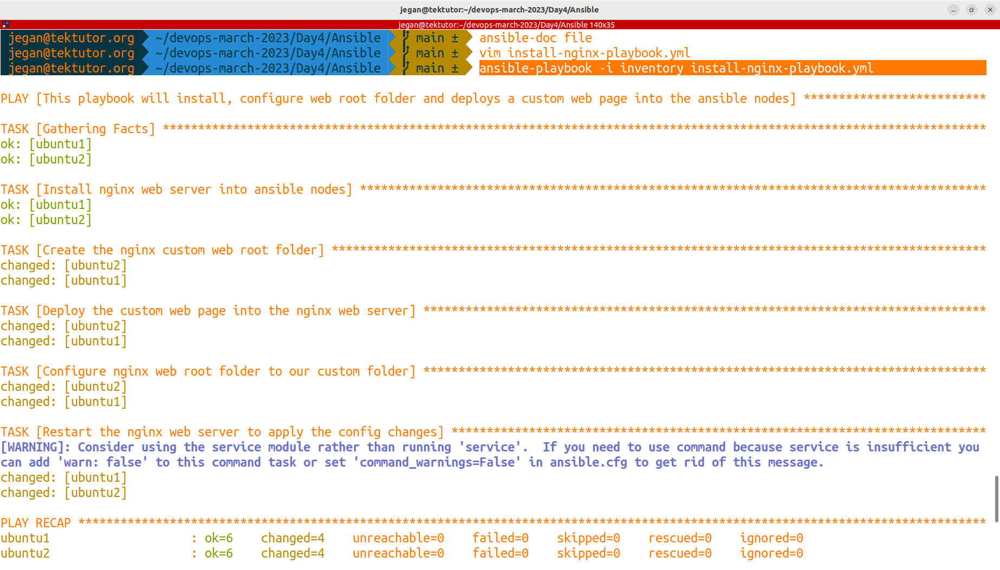
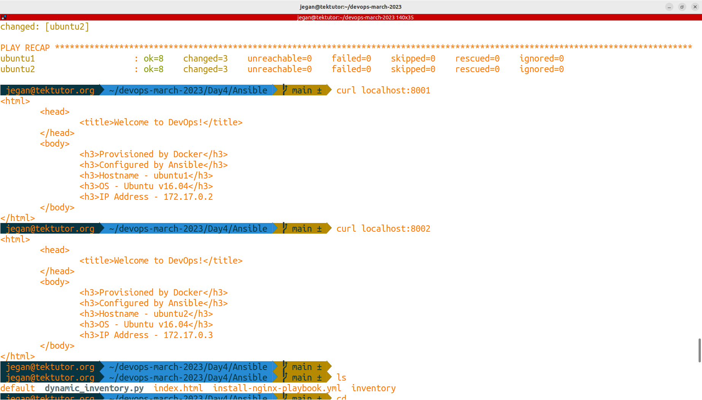
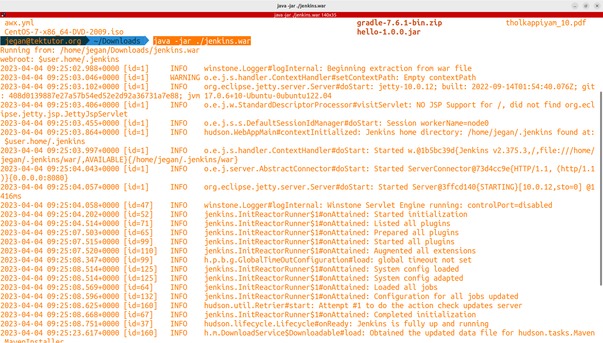
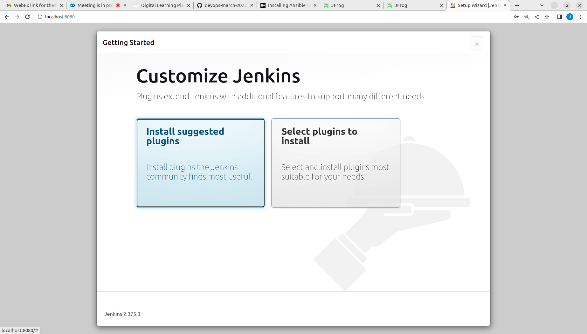
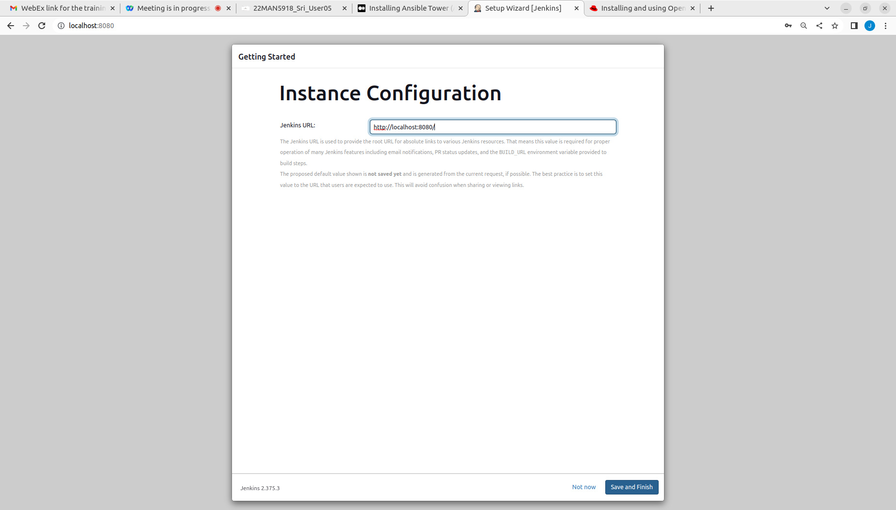
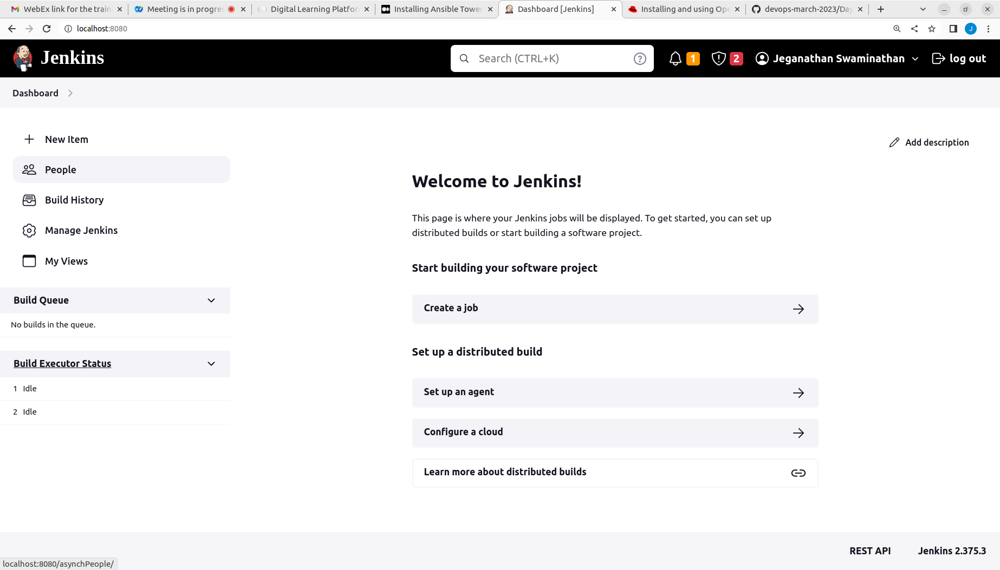

# Day 4

## Setup Maven
```
cd ~/Downloads
wget https://dlcdn.apache.org/maven/maven-3/3.9.1/binaries/apache-maven-3.9.1-bin.tar.gz
tar xvfz apache-maven-3.9.1-bin.tar.gz
cd apache-maven-3.9.1
pwd
```

Edit your ~/.bashrc file and append the below lines at the end of the file
```
export M2_HOME=~/Downloads/apache-maven-3.9.1
export PATH=$M2_HOME/bin:$PATH
```

To apply the bashrc file changes, we need to source the bashrc as shown below
```
source ~/.bashrc
mvn --version
```

## Setup JDK 11
```
sudo yum install -y epel-release
sudo yum install -y java-11-openjdk-devel
```

Edit your ~/.bashrc file and append the below lines at the end of the file
```
export JAVA_HOME=/usr/lib/jvm/java-11-openjdk-11.0.18.0.10-1.el7_9.x86_64
export M2_HOME=~/Downloads/apache-maven-3.9.1
export PATH=$JAVA_HOME/bin:$M2_HOME/bin:$PATH
```

To apply the bashrc file changes, we need to source the bashrc as shown below
```
source ~/.bashrc
mvn --version
```

## Install Docker Community Edition in CentOS
```
sudo yum install -y yum-utils

sudo yum-config-manager --add-repo https://download.docker.com/linux/centos/docker-ce.repo

sudo yum install -y docker-ce docker-ce-cli containerd.io docker-buildx-plugin docker-compose-plugin

sudo systemctl enable docker
sudo systemctl start docker
sudo systemctl status docker
sudo usermod -aG $USER docker
sudo su $USER
docker --version
docker images
```

## Install Ansible in CentOS
```
sudo yum install -y epel-release
sudo yum install -y ansible
ansible --version
```

## Lab - Install nginx web server onto Ansible nodes using Ansible playbook
```
cd ~/devops-march-2023
git pull

cd Day4/Ansible
ansible-playbook -i inventory install-nginx-playbook.yml
```

Expected output




# Day 4 Agenda

## Agile vs Waterfall

## What is DevOps?

## What is Continuous Integration (CI) ?
- application source code is Integrated several times a day
- each code commit, results in triggering a build, which will initiate a pipeline that compiles your code, performs automated tests and share the build reports(along with test report)

## What is Continuous Deployment (CD) ?
- CI certified builds are deployed automatically onto QA environments for further automated tests

## What is Continuous Delivery (CD) ?
- The QA certified application binaries are automatically delivered to the live production environment or to the customer's staging environments
- the customer would then test either manually or using automated test cases and decide whether they wanted to make it live
- customer will share feedback based on their product experience

## What is Jenkins?
- CI Build Server
- Kohsuke Kawaguchi while working at Sun Microsystem developed Jenkins in Java as an opensource CI Build Server
- Sun Microsystems got acquired by Oracle
- initially the product was developed as Hudson
- When the Kohsuke Kawaguchi and like minded people didn't agree with Oracle's plan for Hudson, the team got split into two and many original developers came out of Oracle and they started developing Hudson by forking a new branch called Jenkins. The team which stayed back at Oracle continues to develop the Hudson
- both Hudson and Jenkins shares lot of common code
- Enterprise edition of Jenkins is called Cloudbees
- Alternates
  - Bamboo
  - TeamCity
  - Microsoft Team Foundation Server


## Downloading Jenkins war file

For step by step instruction, you may follow my medium blog here https://medium.com/tektutor/ci-cd-with-maven-github-docker-jenkins-aca28c252fec

```
cd ~/Downloads
wget https://get.jenkins.io/war-stable/2.387.1/jenkins.war
```

Launching jenkins
```
cd ~/Downloads

java -jar ./jenkins.war
```

Expected output





