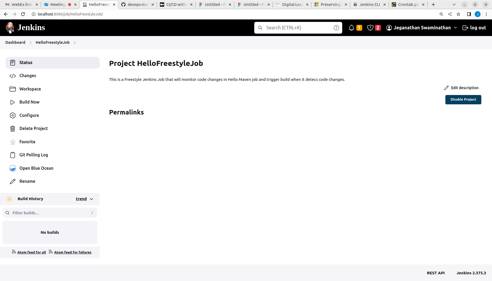
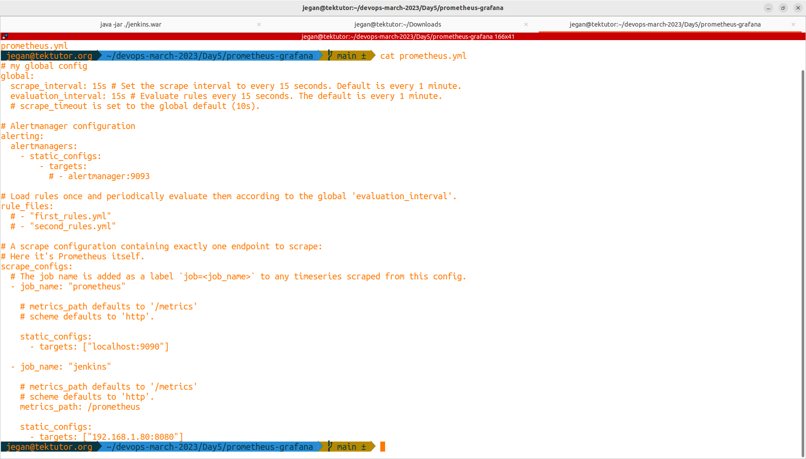

# Day 5

## ⛹️‍♂️ Lab - Creating a Freestyle Jenkins Job





## ⛹️‍♂️ Lab - Invoking Ansible Playbook from a Jenkins Freestyle Job
Create a FreeStyle named "InvokeAnsiblePlaybook" copying the HelloFreeStyleJob. The only change is in the Execute Shell section as shown below


## ⛹️‍♂️ Lab - Invoking Ansible Playbook from a Jenkins Freestyle Job using Jenkins Ansible Plugin
Create a FreeStyle named "InvokeAnsiblePlaybookUsingAnsiblePlugin" copying the HelloFreeStyleJob. The only change is in the Execute Shell section as shown below


# ⛹️‍♂️ Lab - Jenkins Performance Monitoring using Prometheus and plotting performance metrics using Grafana Visualization Dashboard

## Setup Prometheus
In you Jenkins, you need to install Prometheus Metrics Plugin.  After installing, you can verify prometheus REST endpoint URL from your web browser
```
http://localhost:8080/prometheus
```

Expected output

Installing Prometheus Metrics Plugin in Jenkins


Accessing Prometheus Metrics from the Prometheus Metrics REST endpoint URL
<pre>
http://localhost:8080/prometheus
</pre>


Creating Prometheus container
<pre>
docker run --name prometheus --hostname prometheus -p 9090:9090 bitnami/prometheus:latest
</pre>


Accessing Prometheus Dashboard
<pre>
http://localhost:9090
</pre>


## Setup Grafana

Create Grafana container
<pre>
docker run -d --name=grafana -p 3000:3000 grafana/grafana
</pre>


Accessing Grafana Dashboard
<pre>
http://localhost:3000
</pre>
Login to Grafana Dashboard with default credentials
<pre>
username - admin
password - admin
</pre>


Change the Grafana Dashboard password
<pre>
username - admin
password - Admin@123
</pre>


Grafana Dashboard looks like this


### Integrating Jenkins Prometheus Metrics with Prometheus Server
We need to configure the prometheus.yml in the prometheus container.  You need to replace '192.168.1.80' with your RPS centos IP Address before copying it to the prometheus container.
```
cd ~/devops-march-2023
git pull

cd Day5/prometheus-grafana
docker ps
cat prometheus.yml
docker cp prometheus.yml prometheus:/etc/prometheus/prometheus.yml
docker restart prometheus
docker ps
```





### Integrating Prometheus server with Grafana Visualization Server
We need to create a prometheus datasource within Grafana.

Click on create your first datasource and select Prometheus


Click on Save and Test button and you should see "Data source is working" with a green coloured tick mark.


We need to browse and import Prometheus dashboard within Grafan portal


### Importing Jenkins Job stats Dashboard (Import Dashboard ID - 9964)

