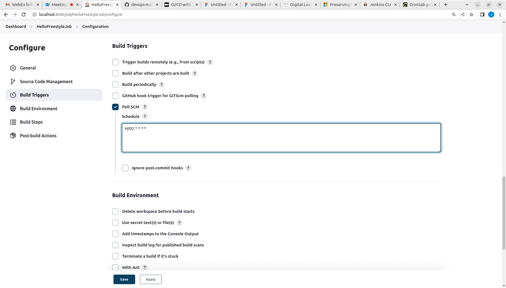

# Day 5

## ⛹️‍♂️ Lab - Creating a Freestyle Jenkins Job

## ⛹️‍♂️ Lab - Invoking Ansible Playbook from a Jenkins Freestyle Job
Create a FreeStyle named "InvokeAnsiblePlaybook" copying the HelloFreeStyleJob. The only change is in the Execute Shell section as shown below

